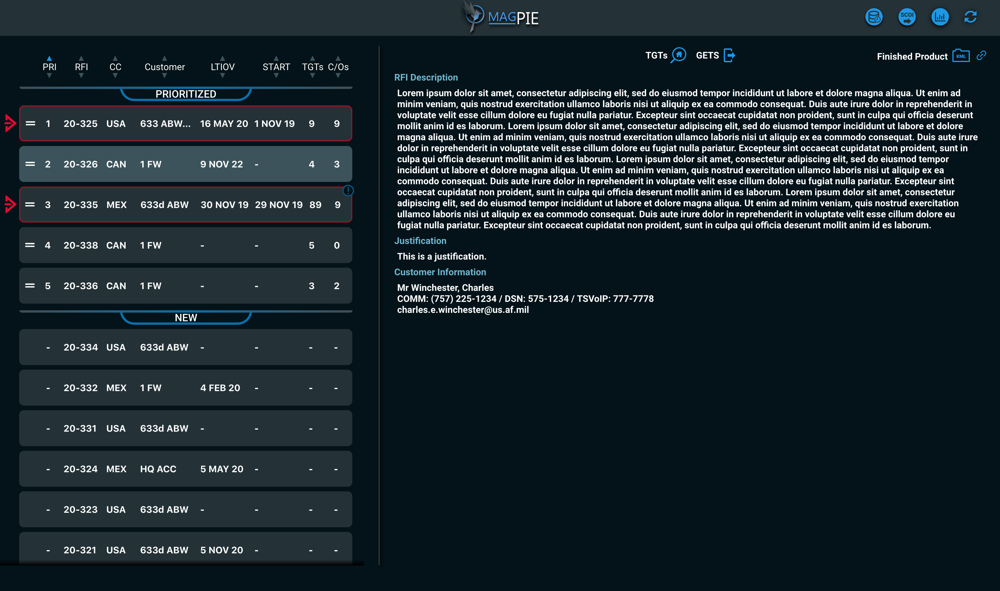

# MagPIE

## Overview
A project to provide a unified workflow for the Post-Ingest Exploitation (PIE) cell empowered through metrics, web design, and customer feedback.

## Setup
### Dependencies
* `mysql stable 5.7.20` (or later)
* `java 1.8`
* `maven 3.5.4` (or later)
* `node 10.16.0` (or later)
* `yarn 1.17.3` (or later)

## Environment Variables
These variables are required:
- `PIE_DB_URL` (string)
- `PIE_DB_USERNAME` (string)
- `GETS_REQUEST_TIME_FRAME_IN_DAYS` (int)
- `GETS_URI_CLOSED` (string)
- `GETS_URI_OPEN_PENDING` (string)

You can setup all required environment variables by running
 
 `source ./scripts/setup_env.sh`
 
 ### Setup the database
 * `./scripts/setup_db.sh`

## Build
### Client
* Be sure dependencies are up to date with `cd client && yarn`
* `cd client && yarn build`

### Backend
* `mvn install`

## Develop
### Client Development Server
* `cd client && yarn start`

### Backend Development Server
* `mvn spring-boot:run`
    * alternatively use IntelliJ `Application` run configuration

## Test
#### Frontend Tests
* `cd client && yarn test`
    * alternatively use IntelliJ `All Frontend` run configuration

#### Backend Tests
* `mvn test`
    * alternatively use IntelliJ `All Backend` run configuration
    
#### All Unit Tests (Frontend and Backend)
* `./scripts/tests.sh unit`

#### Acceptance Tests
* `./scripts/tests.sh acc` or `./scripts/tests.sh acceptance`

#### Acceptance Tests without rebuilding the JAR
* `./scripts/tests.sh anj`

#### Specific Acceptance Tests
* `./scripts/tests.sh acc #` or `./scripts/tests.sh anj #` or `./scripts/tests.sh acceptance #` 
    * replace # with the acceptance test number you want to run

#### All tests
* `./scripts/tests.sh`

## Deploy
Traditionally, it will push at the end of its pipeline cycle (in Jenkins via NGA). You could also log into PCF via CLI:
* `cf login`
* `cf push`

## Resources
- Tracker: https://www.pivotaltracker.com/n/projects/2407835
- Continuous Integration and Deployment: https://jenkins.devops.geointservices.io/job/DGS-1%20Software%20Development%20Team/job/PIE/job/PIE_Multibranch/job/acceptance/
- Acceptance: https://magpie.dev.geointservices.io/

